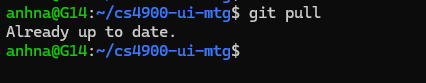
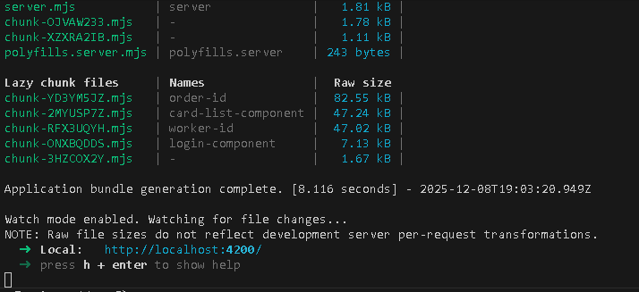
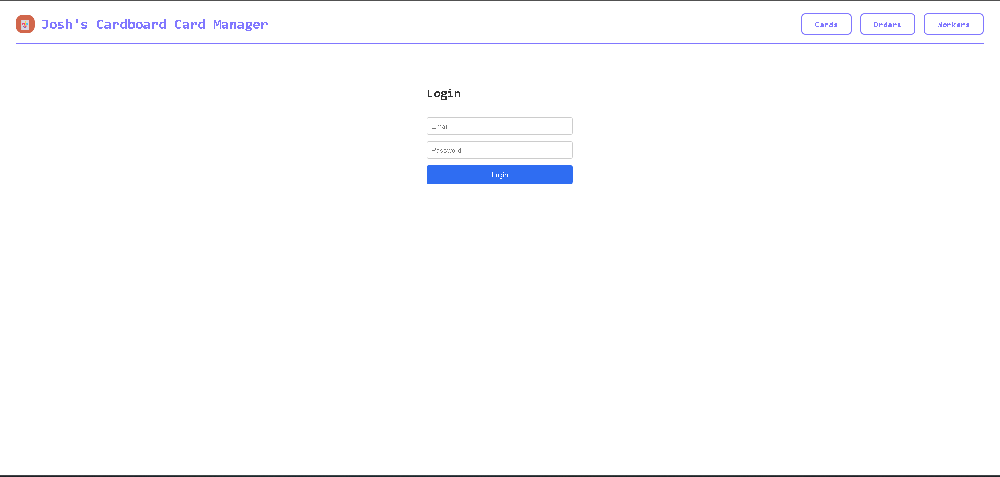

# MTG-Service UI

## Required Tools

- **Node.js**: v16 or higher
- **npm**: v8 or higher
- **Angular CLI**: version 20.3.8.
  ```
  npm install -g @angular/cli
  ```

## Installation

1. Clone the repository using either way:
  
  **HTTPS**
  ```
  git clone https://github.com/WSU-kduncan/cs4900-ui-mtg.git
  ```
  **GIT**
  ```
  git clone git@github.com:WSU-kduncan/cs4900-ui-mtg.git
  ```

2. Install dependencies:

   ```
   npm install
   ```

## Ensure Everything is Up To Date
1.  For the most updated version the works, make sure you are on the **MAIN** branch


2. When you are on **MAIN** branch, `git pull` to ensure no recent updates have happened 


3. Once you have confirmed that you are on **MAIN** branch and everything is up to date, `cd` into mtg-ui.
```
cd mtg-ui/
```
## **NOTE: IF YOU DON'T GO INTO MTG-UI FOLDER, YOU WILL NOT BE ABLE TO RUN THE UI.** 
## Running the UI
1. Make sure everything in API-MTG is running properly, nagigate to cs-4900-api-mtg repo and follow along to the README to ensure everything will run.

**The picture above will signal you that the API is running smoothly**
1. Start the UI:
   ```
   ng serve
   ```


2. Open your browser and navigate to:
   ```
   http://localhost:4200
   ```


Once you reach the login page, everything is running smoothly congrats! You are now able to add cards into the database, update quantity, price and stock. As well create and delete workers, create, delete orders and add items into orders.

To Login, here is the username and password
### **USERNAME**
<details>
  <summary>Username</summary>
  admin
</details>

### **PASSWORD**
<details>
  <summary>Password</summary>
  admin
</details> <br>


**The application will automatically reload when you modify source files.**

